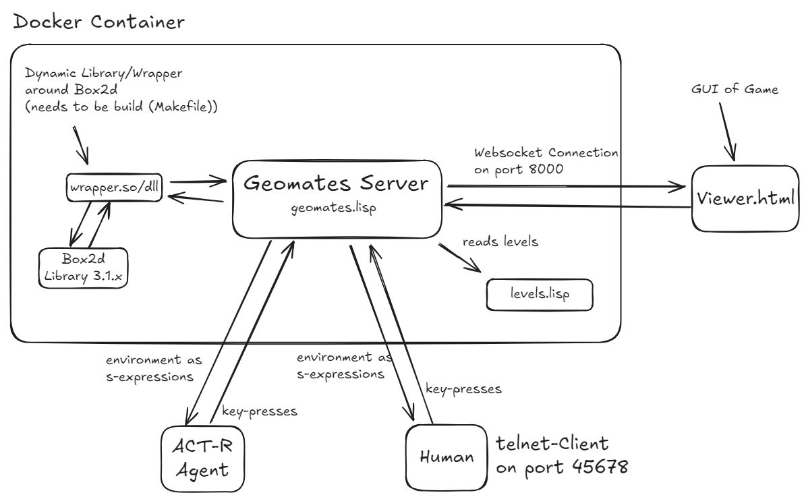

# geomates
This is a clone of the 'geometry friends' competition that was run at IJCAI for several years. This 2D physical simulation game is intended to challenge autonomous agents in a multi-agent setting.

## Gameplay
Two players -- disc and rectangle -- jointly need to collect diamonds in a 2d platform environment. Players are controlled by one autonomous agent (or human). The disc player has the ability to jump up, while the rectangle can shape its shape by adjusting its height/width ratio. Both players can move left and right and are subject to gravity. Additionally, agents can send messages to the other agents (see below).

Levels are defined in levels.lisp, see there for how to design your own levels.

## Principle of Operation and Control
The game is implemented as a server that connects to agents and the GUI using TCP/IP sockets, sending scene information as s-expressions. The GUI is written in JavaScript and should run in any modern web browser.
For convenience of testing, you can connect to the server by telnet to control an agent. See documentation inside geomates.lisp for all the glory details.

Agents are controlled via key codes for a (left), d (right), w (jump, disc only), s (widen shape, rect only), w (grow shape, rect only). Additionally, m(...) can be used to send a message (...) which must be a valid s-expression (i.e., matching paranthesis) to the other agent. See the comments in geomates.lisp for all the glory details.

To make the game controllable by Telnet, telnet has to be switched into byte mode such that keypresses are send immediately. The game server will do so automatically, causing some protocol traffic the gameserver will however treat as control attempts. This is why telnet clients will receive lots of responses, although no key has been pressed.  

The next level starts when either all diamonds are collected or the "s"/"skip" message is send from GUI. The next level doesn't automatically resets the ACT-R model.

## Requirements
[SBCL](https://sbcl.org) as LISP compiler is required. If you have ACT-R installed, you probably already have SBCL.

An overview over the architecture is shown here:


An Tutorial for the Planner/RPC can be found in the moodle.

## Installation game server
The game server can either be installed via docker (recommend) or be build from scratch.
### Docker (recommend)
(tested only on machines with x86 processor)
Download [Docker](https://www.docker.com) and use the provided Dockerfile to build the game environment by <pre><code>docker build -t geomates:latest .</code></pre>
(this may take a while, but is only required once). Note that you cannot provide own levels or change game parameters unless you modify the Docker container.

### Building game sever from scratch 

First install a 3.1.1 version of the box2d library. As of 2025, 2.x versions are still widely shipped with package management systems. These are incompatible with 3.1.1 versions and will not work! Therefore, [download the original](https://github.com/erincatto/box2d) repository and build the library yourself. In case your package manager provides a 3.1.1 library, you may of course use that.

Only a single dynamic liberary (wrapper.dll/so/dylib) needs to be build that wraps around box2d's static library. To do so, edit the Makefile to adjust the paths to where box2s include files and the static library can be found (box2d does not need to be installed system-wide).

**Windows using MSVC**: For Windows use the Windows specific Makefile provided for building the library (thanks, Jendrik!). Note that you must adopt the path names inside the Makefile!

To compile the wrapper DLL:
1. Open "Tools for Command Prompt VStudio x64" (or a similar VS Native Tools Command Prompt).
2. Navigate to the `geomates` directory.
3. Run the following command to build the DLL using the Makefile_Windows (rename it to just Makefile):
   ```cmd
   nmake /a
   ```

## Running the game server 

If you build the docker, use: 
 <pre><code>docker run -p 8000:8000 -p 45678:45678 geomates:latest sbcl --script geomates.lisp</code></pre>
 
Otherwise use:
```sbcl --script geomates.lisp```

Then, open **viewer.html** in a web browser and start your agents. Once both agents have connected, the game starts. It ends when all levels have been played. The list of levels is loaded from levels.lisp.


## Connecting with Telnet (Manual Control)
**Linux** Telnet should be already installed. Otherwise install it via your PackageManger

**Windows:** Telnet is usually shipped with Windows, but it requires extra steps to activate it. [Activating Telnet under windows ](https://blog.mrkeyshop.com/en/guides/how-to-enable-and-use-telnet-on-windows-11-and-10/) or use a telnet client (e.g PuttyTel)

**MacOs:**  You can install telnet using [homebrew](https://brew.sh):  brew install telnet

Connect to the gameserver:
```
telnet localhost 45678
```

Don't forget to switch telnet into byte mode, so that keypresses are send immediately (if it isn't automatically recognized)


## Connecting with ACT-R

Assuming [ACT-R Sources](http://act-r.psy.cmu.edu/actr7.x/actr7.x.zip)  (actr7.x) are [compiled](http://act-r.psy.cmu.edu/actr7.x/QuickStart.txt) and in the same folder as the geomates folder.

Start Geomates server i.e. ``docker run -p 8000:8000 -p 45678:45678 geomates:latest sbcl --script geomates.lisp``

You need two start two agents, so that the agent can begin.
These commands are execute one the folder above the geomates folder: 
```
sbcl --load "actr7.x/load-act-r.lisp" --load "geomates/act-r-experiment.lisp" --eval '(load-act-r-model "geomates/model-dummy.lisp")'
```
When running in the Windows CommandPrompt you may escape the quotation marks differently:
```
sbcl --load "actr7.x/load-act-r.lisp" --load "geomates/act-r-experiment.lisp" --eval "(load-act-r-model \"geomates/model-dummy.lisp\")"
```

to start the agent evaluate `(geomates-experiment)` in the ACT-R REPL to get into the ACT-R GUI Environment `(run-environment)`.


## Author and License 

The game is distributed as open source software as is. Author is Diedrich Wolter, address all requests to him. Geomates uses two Lisp packages provided under the [Apache License 2.0](https://www.apache.org/licenses/LICENSE-2.0) for open source software: [base64](https://github.com/massung/base64) and [sha1](https://github.com/massung/sha1).
